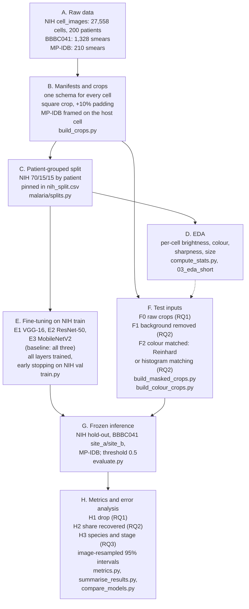
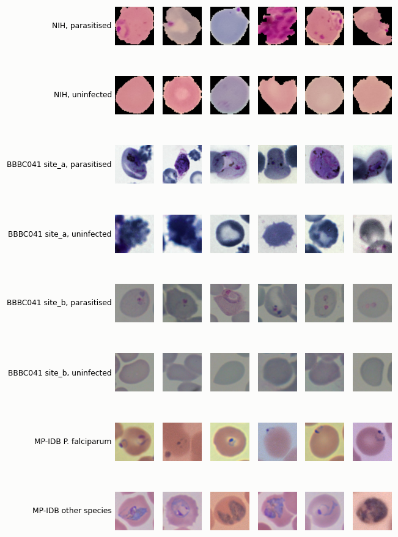
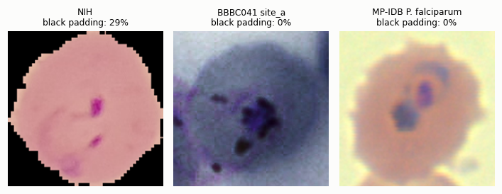
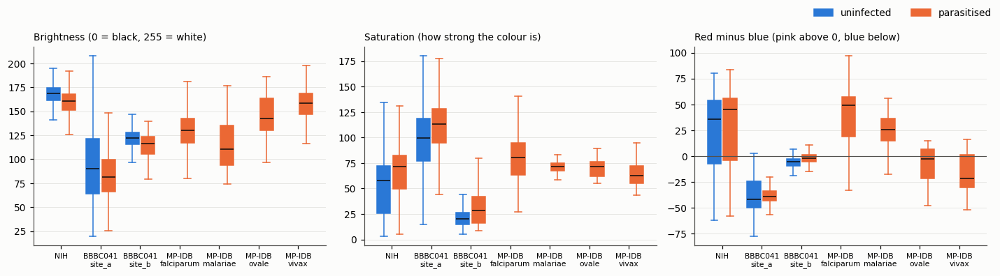
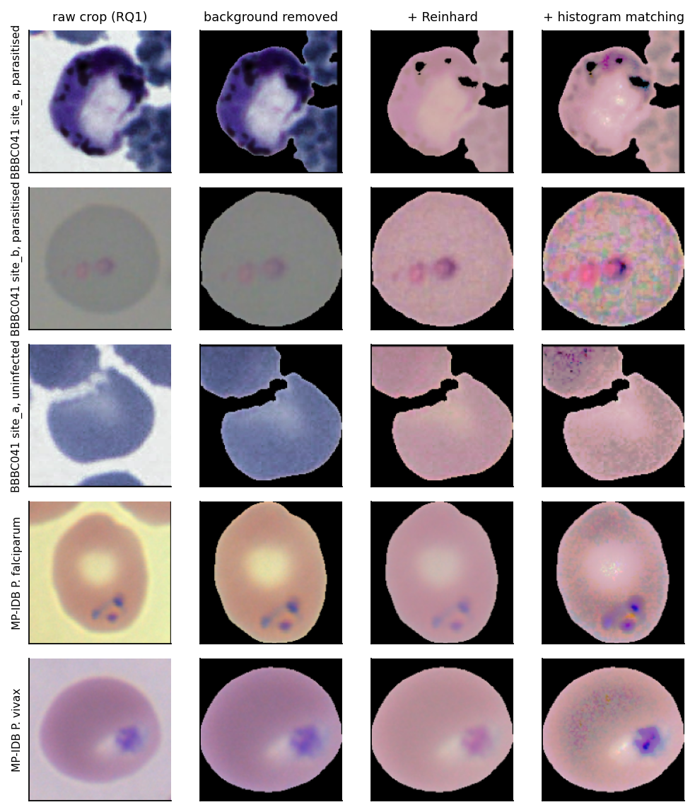
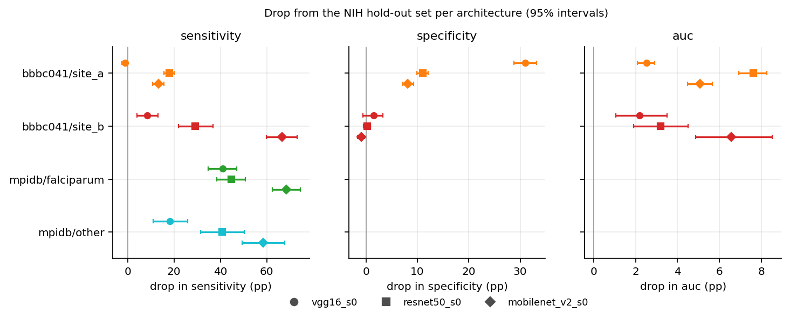

# Methodology Overview

**Deliverable D3, Capstone Portfolio**<br>
**Programme:** MSc Data Science & Society, Tilburg University<br>
**Student:** Noah Tjon Sien Kie (2103939)<br>
**Supervisor:** Dr. Sharon Ong<br>
**Project:** Cross-Dataset Generalisation of Deep Learning for Malaria Classification in Microscopy Images<br>
**Repository:** https://github.com/noahtjonsk/malaria-cross-dataset<br>
**Date:** October 2026

## Purpose of this document

This Methodology Overview (MO) describes how the project is carried out: where the data come from, how the cells are cropped, cleaned and split, which models are trained and how they are compared, and how the results are evaluated. Each step names the script or function that implements it, so anyone with the three public datasets can rerun the work. It should be read alongside:

- the literature review, [`LiteratureReview_NoahTjonSienKie.pdf`](../LiteratureReview_NoahTjonSienKie.pdf)
- the project requirements and run order, [`README.md`](../README.md), with pinned packages in [`requirements.txt`](../requirements.txt)
- the exploratory data analysis, [`notebooks/03_eda_short.ipynb`](../notebooks/03_eda_short.ipynb) (code-free copy [`outputs/03_eda_short.html`](../outputs/03_eda_short.html)); the full record is [`notebooks/01_eda.ipynb`](../notebooks/01_eda.ipynb)
- the ELSA checklist (D5), [`docs/elsa_checklist.md`](elsa_checklist.md)
- the preliminary results in §9 of this document, from `outputs/tables/rq{1,2,3}_<model>_s0.csv` for the three models and the model comparison [`rq1_compare_s0.csv`](../outputs/tables/rq1_compare_s0.csv)
- earlier versions of this MO: the formative PDF [`MethodologyOverview_NoahTjonSienKie.pdf`](methodology/MethodologyOverview_NoahTjonSienKie.pdf) and the corrected [`MethodologyOverview_NoahTjonSienKie_v2.pdf`](methodology/MethodologyOverview_NoahTjonSienKie_v2.pdf)

In short, three ImageNet-pretrained convolutional networks (VGG-16, ResNet-50 and MobileNetV2) are fine-tuned on NIH single-cell images of *P. falciparum* from Chittagong (Rajaraman et al., 2018). They are then applied, without fine-tuning, to two external test sets: BBBC041, *P. vivax* from two acquisition batches (Ljosa et al., 2012; Hung & Carpenter, 2017), and MP-IDB, four species from Lausanne (Loddo et al., 2019). RQ1 measures how much sensitivity and specificity each model loses. RQ2 changes only the test cells, first removing the background and then matching stain colour to NIH, and measures how much of the loss each step recovers. RQ3 breaks the misses down by species and life stage. The trained models never change after RQ1, so any change in RQ2 can be attributed to the step that caused it.

### Research questions

**MRQ.** To what extent do CNNs trained to classify NIH single-cell images as parasitised or uninfected lose sensitivity on BBBC041 and MP-IDB, and specificity on BBBC041, relative to a patient-grouped NIH hold-out set, and which dataset differences explain this drop?

**RQ1.** How large is the drop from the patient-grouped NIH hold-out set, in percentage points, for MobileNetV2, ResNet-50 and VGG-16 applied without fine-tuning to BBBC041 and MP-IDB, and does the lighter architecture lose less than the heavier ones?

**RQ2.** What share of the RQ1 drop is recovered when test cells are matched to NIH at test time, first in crop format (background removed) and then in stain colour (Reinhard or histogram matching)?

**RQ3.** Does sensitivity on the pooled different-species MP-IDB cells (*n* = 140) differ from *P. falciparum* (*n* = 1,297) by more than the resampling interval, and which BBBC041 life stages account for the largest share of missed parasites?

**From gap to question.** The literature review found that no study varies crop format or stain colour on its own while holding the model fixed, so the cause of the cross-dataset drop is still open. Each RQ is a supervised-learning measurement that addresses part of this gap. RQ1 is a model comparison under one shared shift, RQ2 is an ablation on the test inputs, and RQ3 is an error analysis by subgroup. Together they answer the MRQ: how large the drop is, how much of it the two correctable dataset differences explain, and where the remaining errors fall.

## Pipeline overview

The pipeline has eight stages, A to H (Figure 1). Stages A to D prepare and describe the data, E trains the models, F builds the test inputs for RQ1 and RQ2, and G and H run the frozen models and score them. Solid arrows carry data; the dashed arrow marks the EDA choosing the RQ2 steps.



*Figure 1. The pipeline. A static copy is in [`docs/figures/pipeline.png`](figures/pipeline.png) for viewers that do not render Mermaid.*

Stage labels (A to H) are referenced throughout this document.

## §1. Dataset description and access (Stages A and D)

### Sources

All three datasets are public. Neither NIH download has a DOI, so the table cites the dataset paper and the NLM download page. The raw files are not copied into the repository: they sit in the project root, are ignored by git, and are read only through the paths in [`malaria/paths.py`](../malaria/paths.py). `NIH-NLM-ThinBloodSmearsPf` is the release that `cell_images` was cut from (Kassim et al., 2021). 192 of the 200 cell_images patients and 960 of the release's 965 photographs appear in both ([`outputs/tables/nih_source_overlap.csv`](../outputs/tables/nih_source_overlap.csv), [`scripts/check_nih_overlap.py`](../scripts/check_nih_overlap.py)), so it is used only to recut NIH cells for the EDA and never as a test set.

| Dataset | Source and persistent identifier | Role |
|---|---|---|
| NIH cell_images | Rajaraman et al. (2018), [doi:10.7717/peerj.4568](https://doi.org/10.7717/peerj.4568); download from the [NLM malaria datasheet](https://lhncbc.nlm.nih.gov/LHC-research/LHC-projects/image-processing/malaria-datasheet.html) (downloaded 7 May 2026) | training, validation and hold-out |
| NIH-NLM-ThinBloodSmearsPf | Kassim et al. (2021), [doi:10.1109/JBHI.2020.3034863](https://doi.org/10.1109/JBHI.2020.3034863); same NLM page (downloaded 15 Sept 2026) | EDA only (overlaps cell_images) |
| BBBC041 v1 | Ljosa et al. (2012), [doi:10.1038/nmeth.2083](https://doi.org/10.1038/nmeth.2083); Hung & Carpenter (2017), [doi:10.1109/CVPRW.2017.112](https://doi.org/10.1109/CVPRW.2017.112); [bbbc.broadinstitute.org/BBBC041](https://bbbc.broadinstitute.org/BBBC041) (downloaded 7 May 2026) | external test (site_a, site_b) |
| MP-IDB | Loddo et al. (2019), [doi:10.1007/978-3-030-13835-6_7](https://doi.org/10.1007/978-3-030-13835-6_7); [GitHub repository](https://github.com/andrealoddo/MP-IDB-The-Malaria-Parasite-Image-Database-for-Image-Processing-and-Analysis) (downloaded 7 May 2026) | external test (four species) |

### Structure

The table below gives the cell counts at the level the results are reported: by split, acquisition batch, species and life stage. NIH has 27,558 cells from 200 patients and 1,408 photographs. 150 patients contribute parasitised cells and 50 contribute only uninfected cells, and parasitised and uninfected cells are close to 50/50 in every split. BBBC041 is two batches that differ in image size and file format (1,208 images at 1200 × 1600 in PNG and 120 at 1383 × 1944 in JPG). The source does not say which batch came from which country, so they are labelled by observable batch, site_a and site_b. Only 2.7% (site_a) and 5.1% (site_b) of the cells are parasitised. MP-IDB annotates parasites only, so it has no uninfected cells and specificity cannot be measured on it. *P. falciparum*, the NIH species, accounts for 1,297 of its 1,437 parasites; the other three species together have 140.

| Set | Detail | Images | Parasitised | Uninfected |
|---|---|---:|---:|---:|
| NIH train | 140 patients | 958 | 9,619 | 9,584 |
| NIH validation | 30 patients | 239 | 2,105 | 2,073 |
| NIH hold-out | 30 patients | 211 | 2,055 | 2,122 |
| BBBC041 site_a | ring 353, trophozoite 1,473, schizont 179, gametocyte 144 | 1,208 | 2,149 | 77,420 |
| BBBC041 site_b | ring 169, trophozoite 111, schizont 11, gametocyte 12 | 120 | 303 | 5,614 |
| MP-IDB *P. falciparum* | ring 1,230, trophozoite 42, schizont 18, gametocyte 7 | 104 | 1,297 | n/a |
| MP-IDB other species | *P. malariae* 43, *P. ovale* 33, *P. vivax* 64 | 106 | 140 | n/a |

Cells used in the primary metric, read from [`data/manifests/`](../data/manifests/) through `malaria.data.nih_cells` and `test_cells` ([`malaria/data.py`](../malaria/data.py)). BBBC041 also has 446 `difficult` cells and 103 leukocytes, which are excluded (§2).



*Figure 2. Random cells from every test set, as the models see them in RQ1. NIH cells sit on black; the external crops keep their background and parts of neighbouring cells.*

### EDA findings that shaped the method (Stage D)

The EDA ([`notebooks/03_eda_short.ipynb`](../notebooks/03_eda_short.ipynb), full record in [`01_eda.ipynb`](../notebooks/01_eda.ipynb)) measured every cell on tissue pixels only, because a quarter of each NIH crop is black padding that would otherwise dilute brightness and colour averages ([`malaria/imagestats.py`](../malaria/imagestats.py), [`scripts/compute_stats.py`](../scripts/compute_stats.py)). Differences are reported as a rank-based separation between 0 (identical distributions) and 1 (no overlap), computed in `imagestats.separation`. Three findings decided the method.

| Finding | Evidence | Consequence |
|---|---|---|
| Crop format is the largest difference (Figure 3) | The median NIH crop is 26% black padding, and no external crop has any. Separation on the fraction of black pixels is 1.00 against every test set. | RQ2 step F1 removes the background of the test crops. |
| Stain colour differs, in a different direction per test set (Figure 4) | After Giemsa colour deconvolution, BBBC041 cells absorb three to four times as much methyl blue as NIH cells (median 0.065 to 0.090 against 0.022). On the red-minus-blue axis NIH sits close to MP-IDB *P. falciparum*, while BBBC041 sits at or below zero. A hue and saturation shift toward NIH moves methyl blue further away (separation 0.88 against 0.72); Reinhard transfer or histogram matching brings both stain channels close to NIH ([`colour_transform_effect.csv`](../outputs/tables/colour_transform_effect.csv)). | RQ2 step F2 uses Reinhard transfer and histogram matching, not an HSV shift. |
| Sharpness differs in both directions | site_a and *P. malariae* are sharper than NIH; site_b, *P. ovale* and *P. vivax* are blurrier. | A blur sweep cannot reproduce the shift, so the proposal's blur, noise and contrast experiments were dropped from RQ2. |



*Figure 3. Crop format. NIH cells are segmented and placed on black; the external crops are rectangles cut from the smear.*



*Figure 4. Tissue brightness, saturation and red minus blue per test set and class (boxes: quartiles; whiskers: 5th to 95th percentile).*

### Dataset characteristics and bias considerations

**Privacy.** The images are microscope photographs of blood cells. None of the three releases contains names, ages, sex or clinical data. NIH identifies patients only by a code (`C###`), which this project uses to group the split and for nothing else. No new data are collected.

**Licences.** BBBC041 is released under CC BY-NC-SA 3.0, which allows non-commercial use and requires derived data to be shared under the same terms. NIH-NLM-ThinBloodSmearsPf may be redistributed as long as NLM's notice is kept and NLM is credited, and the MP-IDB repository is MIT-licensed. The repository therefore holds code, manifests and summary tables only. No image or crop is redistributed, and the Drive copies used for Colab are private and will be deleted after the project.

**Protected categories.** The data carry no demographic variables, so results cannot be broken down by sex, age or ethnicity. This is a limitation, not a test that passed: a model could still work worse for some patient groups, and this project would not detect it. The subgroups that can be analysed are the ones in the counts table above, which are also the RQ3 subgroups: acquisition site, species and life stage.

**Representativeness.** NIH comes from one hospital, one staining protocol and one smartphone-on-microscope setup, and it has a single species. Its 50/50 class balance is a result of curation: in the source photographs only 3.3% of annotated cells are parasitised, close to site_a's 2.7%. A model tuned to NIH's balance can therefore look better on the hold-out set than it would at clinical prevalence, which is why sensitivity and specificity are reported separately and accuracy is not. The external sets add a second species (*P. vivax*, BBBC041) and a European reference laboratory (MP-IDB), but no smears from sub-Saharan Africa, where most malaria deaths occur. The generalisation claims are limited to these three sources.

**ELSA checklist.** Following the D5 worksheet, the deon checklist was generated and extended with items specific to this project ([`docs/elsa_checklist.md`](elsa_checklist.md)). The table gives the mitigation for each item judged critical. The ELSA consultation is still to come, and this section will be revised after it.

| Checklist item | How the project deals with it |
|---|---|
| Collection bias (A.2) | Every source is reported as its own domain (site_a, site_b, *P. falciparum*, other species), so no pooled score can hide one site. Claims are limited to these three sources. |
| No protected attributes (A.4) | Stated as a limitation: disparities by sex, age or ethnicity cannot be measured. The subgroups that can be measured (site, species, stage) are analysed in RQ3. |
| Licences (A.5) | Only code, manifests and tables are published; images and crops never leave private storage, so BBBC041's share-alike term does not apply to any published file. |
| Prevalence mismatch (C.2) | Training keeps NIH's 50/50 split. Sensitivity and specificity are reported separately, neither depends on prevalence, and accuracy is not reported for BBBC041. |
| Patient leakage (C.6) | Patient-grouped split, pinned and checked before every run; the overlapping NIH-NLM release is never a test set (§3). |
| Disparate error rates (D.2) | Sensitivity by species (interval on the difference) and by BBBC041 life stage; specificity by site; all intervals resample source images. |
| Metric choice (D.3) | A missed parasite and a false alarm have different clinical costs, so both are reported; the 0.5 threshold is fixed before testing. |
| Explainability (D.4) | Saliency maps are out of scope, as in the proposal. RQ2 tests directly whether decisions depend on the background and on colour. |
| Shortcut learning (D.8) | RQ2's first step gives test cells the NIH black frame; the share of the drop it recovers shows how much the model relied on the frame instead of the parasite. |
| Regulation (E.1) | A research prototype on public data, never used on patients. The EU AI Act does not apply to AI developed only for scientific research (Regulation (EU) 2024/1689, Art. 2(6)). A deployed diagnostic version would be a medical device (Regulation (EU) 2017/745), and therefore a high-risk AI system needing clinical validation, which this project does not provide. |

## §2. Cropping, manifests and exclusions (Stage B)

**Scripts:** [`scripts/build_crops.py`](../scripts/build_crops.py), [`malaria/manifests.py`](../malaria/manifests.py), [`malaria/crops.py`](../malaria/crops.py), [`malaria/background.py`](../malaria/background.py)

Every cell, from any dataset, becomes a row in a manifest with one shared schema (`manifests.COLUMNS`): dataset, split, cell ID, crop path, binary label, evaluation group, stage, species, patient, source image and crop box. Later stages read cells only through these tables. The steps are applied in this order:

| Step | Operation | Justification |
|---|---|---|
| 1 | Build one manifest per dataset (`build_nih_manifest`, `build_bbbc041_manifest`, `build_mpidb_wholecell_manifest`) | One schema means every later stage treats the datasets the same way. |
| 2 | Cut BBBC041 cells with one rule (`crops.square_padded_box`): a square around the annotated box, padded by 10%, clipped and flagged where it meets the image border | A square crop matches the square NIH input; the padding keeps the whole cell edge in view. |
| 3 | Recentre MP-IDB crops on the red cell that holds each parasite (`background.host_cell_box`, `build_crops.py --mpidb-wholecell`). The host cell was found for 957 of 1,297 *P. falciparum* parasites; the other 340 (338 in cell clumps, 2 missed) fall back to a cell-sized square centred on the parasite ([`mpidb_wholecell_framing.csv`](../outputs/tables/mpidb_wholecell_framing.csv)) | MP-IDB annotates parasites, not cells, and NIH crops show a whole cell. The shipped close-ups cut off the cell edge and mix masked and unmasked formats by species. |
| 4 | Exclude BBBC041 `difficult` cells (446) and leukocytes (103). They stay in the manifest with `eval_group` set to `excluded_*`, and `data.test_cells` returns only `primary` rows | `difficult` cells are ambiguous by the annotators' own label, and leukocytes are a class the model never saw (the NIH negative class is uninfected red cells). |
| 5 | Never use NIH-NLM-ThinBloodSmearsPf or the MP-IDB parasite close-ups (`mpidb`) as evaluation sets | The first overlaps cell_images (§1); every RQ evaluates whole cells. |
| 6 | Check for missing values | None among the primary cells: each has a path, a label and a source image, and `CellDataset` raises an error on an unlabelled row. |

Output: `data/manifests/*_cells.csv` (rebuilt deterministically, so gitignored) and the crops under `data/crops/`, saved as PNG by dataset, split and class so they can be browsed in a file explorer (see the table in [`README.md`](../README.md)). The reframing keeps every MP-IDB parasite, stage label and cell ID, which the build asserts.

## §3. Splitting and leakage prevention (Stage C)

**Script:** [`malaria/splits.py`](../malaria/splits.py); pinned output [`data/manifests/nih_split.csv`](../data/manifests/nih_split.csv)

NIH is split 70/15/15 by patient (`splits.patient_grouped_split`, seed 42). Patients are assigned greedily, largest first, to whichever split is furthest below its target number of cells, so no patient is split. The assignment does not target class balance, but every split stays close to 50/50 (table below). The split was computed once and written to the tracked `nih_split.csv`, so all three architectures train on the same rows.

### Split similarity

| | Train | Validation | Hold-out |
|---|---:|---:|---:|
| Cells | 19,203 | 4,178 | 4,177 |
| Patients | 140 | 30 | 30 |
| of which only uninfected cells | 36 | 7 | 7 |
| Photographs | 958 | 239 | 211 |
| % parasitised | 50.1 | 50.4 | 49.2 |

The external test sets are kept whole and never split: the models do not see them until Stage G.

### Leakage routes

Kapoor and Narayanan (2023) define leakage as a spurious relationship between inputs and target that comes from the data collection, sampling or preprocessing. The table lists each route that applies here and how it is closed.

| Leakage route | Risk here | Prevention |
|---|---|---|
| No clean train/test separation | cells of one patient share a slide, stain and lighting | split by patient; `check_no_patient_leakage` runs before every training job |
| Duplicates across splits | the same cell saved twice | exact hashes: none; perceptual-hash matches join different patients (EDA section B) |
| Test data in preprocessing | colour reference or threshold fitted on test cells | colour reference from NIH train only; threshold fixed at 0.5 before testing |
| Model selection on test data | choosing epochs, methods or thresholds by test score | early stopping on NIH validation only; both colour methods reported |
| Overlapping releases | NIH-NLM-ThinBloodSmearsPf photographs the same patients | never used as a test set; recut cells inherit their patient's split (`inherit_nih_split`) |

### Continuous-analysis checks

There is no separate test suite. The checks run inside the pipeline (Beaulieu-Jones & Greene, 2017), so a run that breaks an assumption stops with an error instead of producing numbers.

| Check | Where |
|---|---|
| NIH split sizes equal the pinned 19,203 / 4,178 / 4,177; every NIH cell has a split | `data.nih_cells` |
| No patient in two splits; train and validation patients disjoint | `splits.check_no_patient_leakage`, `train.py` |
| Every parameter trainable (the weights are unfrozen) | `models.check_all_trainable` |
| Unlabelled or excluded rows never reach a model | `data.CellDataset`, `data.test_cells` |
| Reframing keeps every MP-IDB parasite, stage label and cell ID | `build_crops.py --mpidb-wholecell` |
| Colour-matched manifests keep the row count of their input | `build_colour_crops.py` |
| Metrics on a perfect predictor: sensitivity and specificity 1, drop 0; the weighted AUC equals scikit-learn's, ties included | `python -m malaria.metrics` |
| A prediction file is reused only if its checkpoint, manifests, crop contents and row count still match; files are written atomically | `evaluate.py`, `results.load` |
| Models are compared only if they were scored on the same manifests, crop contents and cells | `compare_models.check_same_inputs` |
| RQ2 variants hold the same cells | `summarise_results.check_same_cells` |

## §4. Test-time transformations for RQ2 (Stage F)

**Scripts:** [`scripts/build_masked_crops.py`](../scripts/build_masked_crops.py), [`scripts/build_colour_crops.py`](../scripts/build_colour_crops.py), [`malaria/colour.py`](../malaria/colour.py)

RQ2 changes only the test crops. The trained models stay fixed.

| Step | Operation | Justification |
|---|---|---|
| F0 | Raw crops from §2, background kept | The RQ1 input. |
| F1 | Threshold each test crop on brightness with Otsu's method (Otsu, 1979). Keep the connected region under the crop centre, or the nearest one when the centre falls on background (1,029 of 85,922 BBBC041 crops); for MP-IDB keep the region that holds the annotated parasite and add the parasite pixels back. Set everything else to black and cut the result to the square around the kept cell. All 87,472 test crops were processed and no mask came back empty | This is how cell_images crops are cut. Otsu reached a median Dice of 0.90 against the NIH hand-drawn outlines, while rembg U²-Net found no cell in 21% of NIH crops ([`background_method_summary.csv`](../outputs/tables/background_method_summary.csv)). Adding the parasite back means no parasite is removed (median retention before that step 0.98 to 1.00). |
| F2a | Reinhard transfer (Reinhard et al., 2001): match the mean and standard deviation of each Lab channel to the average per-cell mean and standard deviation of NIH cells (`colour.reinhard`) | It rescales each cell's own spread; a spread pooled over many cells would add the differences *between* NIH cells and inflate every test cell's contrast. |
| F2b | Histogram matching: map each RGB channel's quantiles to the pooled NIH quantiles (`colour.match_to_reference`) | A second, non-parametric way to reach the NIH colour distribution. |

Both F2 methods use tissue pixels only and start from the F1 crops. The NIH reference comes from 1,000 randomly drawn *training* cells (seed 0), saved to [`outputs/tables/colour_reference.json`](../outputs/tables/colour_reference.json), so no hold-out cell affects the test inputs. Both methods are reported; neither is chosen by its test score.



*Figure 5. The same test cells as RQ1 and RQ2 see them ([`scripts/make_mo_figures.py`](../scripts/make_mo_figures.py)). Three known artefacts are visible. On BBBC041, Otsu keeps a touching neighbour together with the cell (rows 1 and 3). Very dark site_a pixels fall below the black level and are treated as padding (row 1). Histogram matching stretches the small colour spread of the grey site_b cells and amplifies their noise (row 2).*

## §5. Models and experimental design (Stage E)

**Scripts:** [`malaria/models.py`](../malaria/models.py), [`malaria/data.py`](../malaria/data.py), [`scripts/train.py`](../scripts/train.py), [`notebooks/10_train_colab.ipynb`](../notebooks/10_train_colab.ipynb)

### Model arms

RQ1 compares one lightweight and two heavy architectures, all built by `models.build_model` from torchvision's ImageNet weights (Russakovsky et al., 2015), with the 1,000-class head replaced by a single output. They are the three networks named in the proposal, and they span a sixty-fold range in size while sharing an input size and a pretraining dataset.

| Arm | Model | Parameters (with new head) | Rationale |
|---|---|---:|---|
| E1 | VGG-16 (Simonyan & Zisserman, 2015) | 134.3 M | Plain stacked convolutions; trained first, as the supervisor asked |
| E2 | ResNet-50 (He et al., 2016) | 23.5 M | Residual network; the standard heavy contender |
| E3 | MobileNetV2 (Sandler et al., 2018) | 2.2 M | The lighter architecture RQ1 asks about |

Every arm is trained on the same rows with the same schedule, so the architecture is the only thing that changes between them.

### Baseline protocol: three architectures, fully fine-tuned (E1 to E3)

Following the literature review (§2.3), the baseline is the patient-grouped protocol of Hou et al. (2026) applied to all three architectures, not one model. VGG-16 was trained first, at the supervisor's request, and ResNet-50 and MobileNetV2 followed with identical settings.

- *Architecture.* torchvision weights `IMAGENET1K_V1` for all three, so the pretraining recipe is the same generation. The last layer becomes a single-output linear layer whose output is the logit for *parasitised*: `classifier[6]` in VGG-16, `fc` in ResNet-50, `classifier[1]` in MobileNetV2.
- *Fine-tuning.* Every parameter is trained (VGG-16 134,264,641; ResNet-50 23,510,081; MobileNetV2 2,225,153); no layer is frozen, and `check_all_trainable` asserts this before and after training.
- *Input.* Each crop is padded to a square with black, resized to 224 × 224 and normalised with the ImageNet channel means and standard deviations (`data.pad_to_square`, `data.load_input`).
- *Training.* Binary cross-entropy on the logit, Adam (Kingma & Ba, 2015), mixed precision on the GPU.
- *Output.* `models/<model>_s<seed>.pt`, a per-epoch log (`outputs/tables/<model>_s0_training_log.json`) and a resumable checkpoint written after every epoch. A resumed run must have the settings it started with, and keeps the commit it started at.
- *Where it runs.* A Colab T4 GPU through `notebooks/10_train_colab.ipynb`, which unpacks the archive built by [`scripts/pack_for_colab.py`](../scripts/pack_for_colab.py). On the laptop, `train.py --smoke` checks the same code on 64 cells.

| Model | Epochs run | Best epoch | NIH validation loss | Validation sensitivity / specificity | Minutes per epoch (T4) |
|---|---:|---:|---:|---|---:|
| VGG-16 | 11 | 8 | 0.078 | 98.2% / 96.2% | 3.2 |
| ResNet-50 | 9 | 6 | 0.076 | 96.6% / 97.6% | 1.8 |
| MobileNetV2 | 9 | 6 | 0.077 | 96.5% / 98.0% | 1.3 |

All three stopped early, and their best NIH validation losses differ by less than 0.002, so the three arms enter the external tests equally well fitted to NIH.

### Hyperparameters

The values are fixed in advance (`SETTINGS` in `train.py`) and not tuned.

| Hyperparameter | Value |
|---|---|
| Optimiser | Adam, weight decay 0 |
| Learning rate | 1 × 10⁻⁴ |
| Batch size | 32 |
| Epochs | at most 20 |
| Early stopping | stop when NIH validation loss has not improved for 3 epochs; keep the best-validation weights |
| Decision threshold | 0.5 (`metrics.THRESHOLD`) |
| Augmentation | horizontal and vertical flips, rotation by multiples of 90° (`data.augment`) |
| Seeds | one (seed 0) for the midterm baseline; three per architecture planned for the final results |

No grid search or Optuna is used. Tuning each architecture separately would make the RQ1 comparison partly a comparison of tuning budgets, and a free Colab GPU does not allow a search over three large networks. The chosen values are standard for fine-tuning ImageNet models on this dataset, and early stopping on NIH validation guards against the main risk of a fixed schedule, which is training too long. Only the seed varies, so that each final result is a distribution over runs instead of one run.

**Class balance and resampling.** NIH training cells are 50.1% parasitised, so the training data are neither undersampled nor oversampled, and the loss is not reweighted. The imbalance that matters is at test time (2.7 to 5.1% on BBBC041). It is handled by reporting sensitivity and specificity separately, since neither depends on prevalence.

**Augmentation.** A cell turned upside down is still the same cell, so flips and 90° rotations do not change colour, brightness or the black frame. The proposal also listed minor brightness adjustments; these were dropped on 29 September. RQ2 measures how much of the drop is recovered by matching test colours to NIH. A model already trained to ignore colour and brightness would leave less for that step to recover, by an amount that depends on an arbitrary jitter strength. The supervisor left this choice to the student. Hou et al. (2026) trained with colour jitter and still saw specificity fall to 18.0% on BBBC041, so jitter alone is not the fix.

### Model information sheet

| Field | Value |
|---|---|
| Task | Binary classification of a single red-cell image as parasitised or uninfected |
| Input | One RGB cell crop, padded to a square with black, 224 × 224, ImageNet-normalised |
| Output | A logit; the cell is called parasitised when the probability is at least 0.5 |
| Training population | 19,203 NIH cells from 140 patients, one hospital in Chittagong, *P. falciparum* only, about 50% parasitised |
| External evaluation | BBBC041 site_a and site_b (*P. vivax*, 2.7 to 5.1% parasitised) and MP-IDB (four species, parasitised cells only), without fine-tuning |
| Intended use | Academic research into why CNN malaria classifiers lose performance across datasets |
| Out-of-scope use | Diagnosis or screening of patients, or any clinical decision; the model has no clinical validation |
| Known limitations | Single training site and species; no demographic variables; one seed at the midterm; MP-IDB has no uninfected cells, so specificity is measured on BBBC041 only |
| Failure modes seen so far | Large loss of sensitivity on MP-IDB *P. falciparum* for every architecture; VGG-16 raises many false alarms on BBBC041 site_a, while ResNet-50 and MobileNetV2 miss more parasites; MobileNetV2 misses most site_b parasites; colour matching shifts scores toward *parasitised* (§9) |

## §6. Fair model comparison

The following are held constant across the three arms and across the RQ2 variants:

- the NIH train, validation and hold-out rows in `nih_split.csv`;
- the input pipeline (black padding to square, 224 px, ImageNet normalisation) and augmentation;
- the optimiser, learning rate, batch size and stopping rule;
- the test cells: the same primary rows of NIH hold-out, BBBC041 site_a and site_b, MP-IDB *P. falciparum* and other species;
- the decision threshold of 0.5, fixed before any test set was seen;
- the metric code and the bootstrap: each set's resamples are keyed by its name, so every model and variant is resampled on the same NIH patients and test photographs;
- the code commit and the inputs, checked: `run.json` records, per prediction file, the checkpoint, the manifest hashes and a digest of the crops read, and `compare_models.py` refuses models whose inputs differ.

What differs between arms is the architecture, and what differs between RQ2 variants is the test input. This is what lets a difference in drop be attributed to one of the two.

## §7. Evaluation strategy (Stages G and H)

**Scripts:** [`scripts/evaluate.py`](../scripts/evaluate.py), [`malaria/metrics.py`](../malaria/metrics.py), [`scripts/summarise_results.py`](../scripts/summarise_results.py)

### Metrics

All definitions follow Table 2 of the literature review. The task is binary classification with parasitised as the positive class. *Sensitivity* is the share of parasitised cells called parasitised, and *specificity* the share of uninfected cells called uninfected. Specificity is measured on NIH and BBBC041 only, since MP-IDB has no uninfected cells. AUC is a threshold-free check on NIH and BBBC041. The *drop* is the NIH hold-out value minus the test-set value, in percentage points, per model and test set (`metrics.drop_pp`).

Accuracy, F1 and AUC were considered as the main metric and rejected. At 2.7% prevalence, a model that calls every BBBC041 cell uninfected scores 97.3% accuracy. A high AUC can also sit alongside an unusable operating point: Zhao et al. (2020) report an AUC of 0.945 on BBBC041, while Hou et al. (2026) found 18.0% specificity at their threshold. A missed parasite and a false alarm also have different clinical costs, so they are reported separately.

### Uncertainty

Every value has a 95% percentile interval from a bootstrap that resamples *source images*, not cells (`metrics.bootstrap`, 2,000 resamples for every metric). Cells cut from one photograph share its stain, focus and lighting, so treating them as independent would make the intervals too narrow. The NIH hold-out set is resampled one level higher, by *patient* (30 patients, `metrics.reference_draws`), since a patient's photographs come from one slide. The test sets have no patient identifiers, so they are resampled by photograph. The interval for a drop comes from resampling the NIH hold-out set and the test set independently and taking the difference of the draws. Each set's random stream is keyed by its name (`metrics.resample_weights`): different sets are resampled independently, while the same set is resampled identically for every model and variant, which makes differences between models paired. With three seeds, the spread between runs will be reported next to these intervals.

### Model comparison (RQ1) and ablation (RQ2)

All arms are scored by `evaluate.py` on the same test sets, with the same cells and the same threshold. RQ1 compares the drops of the three architectures. For every pair of models, test set and metric, [`scripts/compare_models.py`](../scripts/compare_models.py) gives the difference in drop with a paired bootstrap interval. With three models that is 24 comparisons, so it also gives Bonferroni-adjusted intervals (level 1 − 0.05/24), and a difference counts as clear only when the adjusted interval excludes zero (open decision 3, §12). For RQ2, the frozen models score each test set on F0, F1 and both F2 variants. The *share recovered* is (value after a step − value before it) divided by the RQ1 drop, reported for each step and in total (`metrics.share_recovered`). It is left undefined unless the raw drop is clearly above zero, i.e. the lower end of its 95% interval is positive: with no measurable drop there is nothing to recover, and dividing by a drop near zero gives meaningless shares, such as −62 on a 1.5-point drop whose interval includes zero (open decision 4).

### Error analysis (RQ3)

`summarise_results.py` breaks down the misses of each model. Sensitivity on pooled other-species MP-IDB cells is compared with *P. falciparum*, with an image-resampled interval on the difference. For BBBC041, the table gives each life stage's share of all missed parasites (the approved RQ3 wording) together with its miss rate. The miss rate is shown because the shares follow the stage counts: trophozoites are 69% of site_a parasites, so they would account for most misses even at an average miss rate. The 340 MP-IDB fallback crops (§2) are included, and the species result is also reported without them (open decision 6).

### Out-of-sample testing

The NIH hold-out patients are used once, after training, and BBBC041 and MP-IDB are never used for training, early stopping, the colour reference or the threshold. Both external sets are therefore out-of-distribution tests in the sense the MRQ needs.

## §8. Methodological alternatives

Each main design choice is set against the alternative it replaced. Most choices follow from one constraint: RQ2 can attribute a change in performance to a step only if the model and the test cells stay fixed in every other way.

| Chosen | Instead of | Reason |
|---|---|---|
| Fine-tune all layers | Frozen ImageNet features plus a new head (Rajaraman et al., 2018) | asked for by the supervisor; stain and cell texture are far from ImageNet photographs, so the early layers need to adapt too |
| Patient-grouped split | Random cell-level split (Zhao et al., 2020) | a random split puts cells of one slide on both sides; Hou et al. (2026) found accuracy 1.5 points higher per cell than slide-disjoint |
| Fixed hyperparameters | Grid search or Optuna per model | keeps RQ1 a comparison of architectures, not of tuning budgets; fits a free Colab GPU |
| Change test inputs (RQ2) | Colour augmentation or retraining on target images | needs no target labels, and the model stays fixed, so each step's effect is attributable; retraining answers a different question |
| Otsu on brightness | rembg U²-Net or IS-Net (Qin et al., 2020) | median Dice 0.90 against the NIH hand-drawn outlines, against 0.03 for U²-Net, which found no cell in 21% of NIH crops; BiRefNet needs 31 s per crop on this laptop |
| Reinhard and histogram matching | Macenko (Macenko et al., 2009) or learned normalisation (Xu et al., 2025) | both are simple and fully specified, and the EDA showed they bring the Giemsa stain channels to NIH while an HSV shift moves them away; Xu et al. (2025) found stain-vector methods beat Reinhard on malaria smears, so a Macenko step is a candidate extension |
| Whole-cell MP-IDB crops | Shipped parasite close-ups | the close-ups cut off the cell edge, and the shipped crops mix masked and unmasked formats by species |
| Sensitivity and specificity at 0.5 | Accuracy, F1 or AUC alone | prevalence of 2.7 to 5.1% on BBBC041; the two errors have different clinical costs |
| Image-level bootstrap | Cell-level bootstrap or a single test score | cells of one image are not independent; gives intervals instead of point estimates |

## §9. Preliminary results (baseline, seed 0)

The three arms were trained on a Colab T4 (VGG-16 on 30 September, ResNet-50 and MobileNetV2 on 2 October 2026) and scored on the same crops: one code commit and identical crop digests in each `outputs/tables/<model>_s0_run.json`. VGG-16 was re-scored on the rebuilt colour crops; its values moved by at most 0.02 points. These are single-seed results: they show that the pipeline works and how large the effects are, not the final answer to any RQ.

### RQ1: how large is the drop, and does the lighter architecture lose less?

| Test set, metric | VGG-16 | ResNet-50 | MobileNetV2 |
|---|---|---|---|
| NIH hold-out sensitivity | 98.2 (96.8 to 99.3) | 97.2 (95.6 to 98.5) | 97.1 (95.3 to 98.2) |
| NIH hold-out specificity | 96.6 (94.7 to 97.9) | 98.4 (97.8 to 98.9) | 98.2 (97.5 to 98.8) |
| site_a sensitivity | 99.3 (drop −1.1) | 79.3 (drop 17.9) | 83.7 (drop 13.4) |
| site_a specificity | 65.5 (drop 31.0) | 87.3 (drop 11.0) | 90.0 (drop 8.1) |
| site_a AUC | 97.2 (drop 2.5) | 92.0 (drop 7.6) | 94.5 (drop 5.1) |
| site_b sensitivity | 89.8 (drop 8.5) | 68.0 (drop 29.2) | 30.4 (drop 66.7) |
| site_b specificity | 95.0 (drop 1.5) | 98.1 (drop 0.2) | 99.1 (drop −0.9) |
| site_b AUC | 97.5 (drop 2.2) | 96.4 (drop 3.2) | 93.0 (drop 6.6) |
| MP-IDB *P. falciparum* sensitivity | 57.4 (drop 40.9) | 52.6 (drop 44.6) | 28.6 (drop 68.5) |
| MP-IDB other species sensitivity | 80.0 (drop 18.2) | 56.4 (drop 40.8) | 38.6 (drop 58.5) |

Values in %, fixed threshold 0.5; drops in percentage points from the same model's NIH hold-out value. Intervals for every value and drop are in [`rq1_vgg16_s0.csv`](../outputs/tables/rq1_vgg16_s0.csv), [`rq1_resnet50_s0.csv`](../outputs/tables/rq1_resnet50_s0.csv) and [`rq1_mobilenet_v2_s0.csv`](../outputs/tables/rq1_mobilenet_v2_s0.csv).



*Figure 6. Drop from the NIH hold-out set per architecture, with 95% intervals ([`compare_models.py`](../scripts/compare_models.py)).*

All three models do equally well on NIH (AUC 0.996 to 0.997), and all three lose on at least one metric on every external set, but they lose in different places. MobileNetV2, the lighter architecture, does not lose less. It loses the most sensitivity on site_b and on both MP-IDB groups, by 17.7 to 58.2 points more than the heavier models, and every one of these differences stays clear of zero after the Bonferroni adjustment (for example 27.6 points more than VGG-16 on *P. falciparum*, adjusted interval 20.5 to 34.4). On site_a the order reverses: VGG-16 loses 31.0 points of specificity, 22.9 more than MobileNetV2 (adjusted 19.8 to 25.9). VGG-16 has the smallest AUC drop on both BBBC041 sites. Of the 24 pairwise differences, 20 stay clear of zero after adjustment; the four that do not are VGG-16 against ResNet-50 on *P. falciparum* sensitivity (3.8 points, adjusted −9.0 to 1.3), site_b specificity and site_b AUC, and VGG-16 against MobileNetV2 on site_b specificity ([`rq1_compare_s0.csv`](../outputs/tables/rq1_compare_s0.csv)).

Much of the difference between the architectures lies in where their scores fall relative to the 0.5 threshold. VGG-16 calls 34% of BBBC041 cells parasitised, against 14% for ResNet-50 and 11% for MobileNetV2, which is why it keeps its sensitivity and loses specificity while the other two do the opposite. AUC, which ignores the threshold, still favours VGG-16 on both sites. The answer to RQ1's second part is therefore no at the fixed threshold, with the caveat that part of the lighter model's loss is a shift of its scores toward *uninfected* on the external sets.

### RQ3: species and life stages

| Model | *P. falciparum* minus other species (pp, 95% CI) | site_a stage with most misses (share; miss rate) | site_b stage with most misses (share; miss rate) |
|---|---|---|---|
| VGG-16 | −22.6 (−31.7 to −13.1) | ring (93%; 4.0%) | ring (71%; 13.0%) |
| ResNet-50 | −3.8 (−14.9 to 7.7) | trophozoite (55%; 16.5%) | ring (64%; 36.7%) |
| MobileNetV2 | −10.0 (−21.0 to 0.7) | trophozoite (46%; 11.0%) | ring (52%; 65.1%) |

Sources: `rq3_<model>_s0.csv`. Only VGG-16 shows a species gap larger than its interval, and it runs the opposite way to a species effect: *P. falciparum*, the NIH species, is detected less often. 1,230 of the 1,297 MP-IDB *P. falciparum* parasites are rings. On BBBC041 site_b, rings account for the largest share of misses for all three models (52 to 71%); MobileNetV2 misses 65% of site_b rings and also 80% of site_b trophozoites. On site_a, trophozoites (69% of the parasites) account for the largest share of misses for ResNet-50 and MobileNetV2, while their miss rate stays below that of rings and gametocytes.

For VGG-16 a likely reading is that the model misses the smallest parasite form, the ring, wherever it occurs, and that its MP-IDB species gap comes from the stage mix, not from the species. The other two models do not show this pattern as clearly, so the final analysis tests it directly by comparing ring sensitivity across the two MP-IDB groups, for each model and seed.

### RQ2: background removal and colour matching

| Test set, metric | Model | Raw | Background removed | + Reinhard | + Histogram matching |
|---|---|---:|---:|---:|---:|
| site_a sensitivity | VGG-16 | 99.3 | 99.4 | 80.5 | 99.8 |
|  | ResNet-50 | 79.3 | 92.6 | 42.8 | 98.4 |
|  | MobileNetV2 | 83.7 | 84.3 | 15.9 | 96.6 |
| site_b sensitivity | VGG-16 | 89.8 | 90.8 | 89.8 | 100.0 |
|  | ResNet-50 | 68.0 | 73.6 | 75.9 | 95.0 |
|  | MobileNetV2 | 30.4 | 36.6 | 47.2 | 80.5 |
| MP-IDB *P. falciparum* sensitivity | VGG-16 | 57.4 | 71.9 | 66.4 | 99.5 |
|  | ResNet-50 | 52.6 | 63.9 | 52.3 | 98.1 |
|  | MobileNetV2 | 28.6 | 27.2 | 32.9 | 95.4 |
| MP-IDB other species sensitivity | VGG-16 | 80.0 | 82.9 | 70.0 | 100.0 |
|  | ResNet-50 | 56.4 | 67.9 | 42.1 | 99.3 |
|  | MobileNetV2 | 38.6 | 37.9 | 28.6 | 88.6 |
| site_a specificity | VGG-16 | 65.5 | 53.6 | 74.9 | 5.9 |
|  | ResNet-50 | 87.3 | 66.6 | 82.0 | 6.6 |
|  | MobileNetV2 | 90.0 | 78.9 | 96.3 | 44.4 |
| site_b specificity | VGG-16 | 95.0 | 86.2 | 80.3 | 1.1 |
|  | ResNet-50 | 98.1 | 98.3 | 89.8 | 15.0 |
|  | MobileNetV2 | 99.1 | 97.2 | 98.1 | 41.9 |
| site_a AUC | VGG-16 | 97.2 | 96.6 | 85.6 | 91.6 |
|  | ResNet-50 | 92.0 | 90.2 | 74.5 | 72.7 |
|  | MobileNetV2 | 94.5 | 89.6 | 84.1 | 88.5 |
| site_b AUC | VGG-16 | 97.5 | 95.8 | 93.7 | 73.0 |
|  | ResNet-50 | 96.4 | 96.1 | 91.6 | 72.5 |
|  | MobileNetV2 | 93.0 | 87.2 | 87.6 | 69.4 |

Values in %; the table holds every external set and metric, and the shares recovered and intervals are in `rq2_<model>_s0.csv`. Removing the background raises MP-IDB *P. falciparum* sensitivity for VGG-16 (recovering 36% of its drop) and ResNet-50 (25%), but not for MobileNetV2. It also raises site_b sensitivity for all three models (by 1.0 to 6.2 points) and MP-IDB other-species sensitivity for ResNet-50 (56.4 to 67.9), while it lowers site_a specificity for all three and site_b specificity for VGG-16 (95.0 to 86.2). Reinhard transfer raises site_a specificity for VGG-16 and MobileNetV2 but costs site_a sensitivity, down to 15.9% for MobileNetV2; on site_b it raises sensitivity for MobileNetV2 (30.4 to 47.2) and ResNet-50 (68.0 to 75.9). Histogram matching pushes almost every cell to *parasitised* for all three models: sensitivity is 80 to 100% on every set, while specificity falls to 5.9 to 44.4% on site_a and 1.1 to 41.9% on site_b. Compared with the raw crops, no step raises AUC on either BBBC041 site for any model. Leaving out the 1,022 BBBC041 cells whose mask fell back to a neighbouring region changes no BBBC041 value by more than 2.2 points for any model (`rq2_<model>_s0_without_nearest.csv`).

At the fixed threshold, the colour steps mostly move the models' scores instead of improving how well they separate the classes, and this holds for all three architectures. This has a methodological consequence. On MP-IDB, which has no uninfected cells, a higher sensitivity cannot tell a better model from one that calls more cells parasitised: histogram matching "recovers" 85 to 110% of the MP-IDB drops while destroying specificity on BBBC041. For the final analysis, RQ2's share recovered is therefore read together with BBBC041 specificity and AUC for the same step, and a sensitivity gain on MP-IDB counts as recovery only if AUC on BBBC041 does not fall (open decision 7).

| Figure | What it shows |
|---|---|
| [`R_vgg16_s0.png`](../outputs/figures/R_vgg16_s0.png) | VGG-16: every test set and metric, raw crops and the three RQ2 variants |
| [`R_resnet50_s0.png`](../outputs/figures/R_resnet50_s0.png) | the same for ResNet-50 |
| [`R_mobilenet_v2_s0.png`](../outputs/figures/R_mobilenet_v2_s0.png) | the same for MobileNetV2 |

## §10. Repository organisation

```
malaria-cross-dataset/
├── README.md                    # run order and where every crop is saved
├── requirements.txt             # pinned Python packages
├── LiteratureReview_NoahTjonSienKie.pdf   # D2
│
├── malaria/                     # the package every script imports
│   ├── paths.py                 # all dataset roots, output folders and measured constants
│   ├── crops.py                 # Stage B: square_padded_box cropping rule
│   ├── manifests.py             # Stage B: one manifest schema, builders per dataset
│   ├── splits.py                # Stage C: patient-grouped split, leakage check
│   ├── imagestats.py            # Stage D: per-cell features on tissue pixels, separation
│   ├── background.py            # Stages B/F: Otsu masks, host-cell framing, Dice
│   ├── colour.py                # Stage F: Reinhard, histogram matching, stain channels
│   ├── data.py                  # Stage E: nih_cells, test_cells, CellDataset
│   ├── models.py                # Stage E: build_model, check_all_trainable
│   ├── metrics.py               # Stage H: rates, drop, share recovered, paired bootstrap
│   ├── results.py               # Stage H: reads prediction files back as the reported sets
│   ├── provenance.py            # code commit, manifest hashes and crop digests of every run
│   └── plots.py                 # figure helpers
│
├── scripts/
│   ├── build_crops.py           # Stage B: manifests and crops
│   ├── check_nih_overlap.py     # Stage A: NIH-NLM release vs cell_images
│   ├── compute_stats.py         # Stage D: per-cell statistics
│   ├── compute_colour_stats.py  # Stage D: colour-space statistics
│   ├── validate_background.py   # Stage D: scores background-removal methods
│   ├── build_masked_crops.py    # Stage F1: background removal
│   ├── build_colour_crops.py    # Stage F2: Reinhard and histogram matching
│   ├── pack_for_colab.py        # Stage E: data archives for Colab
│   ├── train.py                 # Stage E: fine-tuning
│   ├── evaluate.py              # Stage G: frozen inference, per-cell predictions
│   ├── summarise_results.py     # Stage H: RQ1/RQ2/RQ3 tables and figure, per model
│   ├── compare_models.py        # Stage H: RQ1 paired differences in drop between models
│   ├── make_mo_figures.py       # figures for this document
│   ├── make_notebook.py         # generates notebooks/01_eda.ipynb
│   ├── make_week4_deck.py       # supervision slides
│   └── make_d2_docs.py          # literature review working documents
│
├── notebooks/
│   ├── 01_eda.ipynb             # full EDA record (generated)
│   ├── 02_eda_core.ipynb        # core EDA
│   ├── 03_eda_short.ipynb       # short EDA, the version presented
│   ├── 04_methodology_explained.ipynb
│   └── 10_train_colab.ipynb     # Stages E and G on a Colab GPU
│
├── data/
│   ├── manifests/
│   │   ├── nih_split.csv        # tracked: pins the train/val/hold-out rows
│   │   ├── mpidb_stage_audit.csv  # tracked: source of every MP-IDB stage label
│   │   └── *_cells.csv          # gitignored: rebuilt by build_crops.py
│   └── crops/                   # gitignored: about 87k PNGs, rebuilt by the build scripts
│
├── outputs/
│   ├── figures/                 # EDA and results figures
│   ├── tables/                  # summary tables (rq1/rq2/rq3, colour reference, overlap)
│   └── predictions/             # gitignored: per-cell predictions (kept on Drive)
│
├── models/                      # gitignored: trained weights (0.5 GB per VGG-16)
│
└── docs/
    ├── methodology_overview.md  # this document (D3)
    ├── figures/pipeline.png     # Figure 1
    ├── elsa_checklist.md        # D5 checklist and mitigations
    └── methodology/             # earlier LaTeX/PDF versions of the MO and their figures
```

The four source datasets (`cell_images_NIH/`, `malaria_BBBC041/`, `MP-IDB-…/`, `NIH-NLM-ThinBloodSmearsPf/`) sit in the project root and are gitignored. Images and crops are never committed, because of their size and because BBBC041's licence requires derived data to be shared under the same terms.

## §11. Reproducibility

### Smoke check on a CPU

```bash
pip install -r requirements.txt
python scripts/train.py --arch vgg16 --smoke --no-pretrained
python -m malaria.metrics                      # metric self-test
```

### Data preparation (Stages A to D)

```bash
python scripts/build_crops.py                  # manifests and crops
python scripts/build_crops.py --mpidb-wholecell
python scripts/compute_stats.py --workers 6
python scripts/compute_stats.py --manifest mpidb_wholecell_cells.csv
python -m nbconvert --to notebook --execute --inplace notebooks/03_eda_short.ipynb
```

### RQ2 test inputs (Stage F)

```bash
python scripts/build_masked_crops.py --method otsu-gray --datasets bbbc041 mpidb_wholecell
python scripts/build_colour_crops.py
```

### Training, evaluation and summary (Stages E, G, H)

```bash
python scripts/pack_for_colab.py          # code.zip, data_raw.zip, data_rq2.zip
# on Colab, through notebooks/10_train_colab.ipynb, for each of vgg16, resnet50, mobilenet_v2:
python scripts/train.py --arch vgg16 --seed 0 --resume
python scripts/evaluate.py --checkpoint models/vgg16_s0.pt --variants raw masked reinhard histmatch
python scripts/summarise_results.py --model vgg16_s0
# then once:
python scripts/compare_models.py          # RQ1: paired differences in drop
```

The full run order, including the EDA-only steps, is in [`README.md`](../README.md). Seeds are fixed for the split (42), the colour reference sample (0), the bootstrap (0) and each training run (`--seed`).

### Reproducibility boundary

The code, the pinned split, the manifests' build logic and every summary table are public in the repository. The images are not: anyone reproducing the work downloads the three datasets from the sources in §1 and places them in the project root. Training needs a GPU (a free Colab T4 is enough: about three minutes per epoch for VGG-16, under two for the other two models); everything else runs on a CPU. Following Di Cosmo et al. (2026), the repository will be archived with a persistent identifier at the end of the project.

## §12. Open decisions for the supervisor

Agreed already: the RQs as worded in the literature review, VGG-16 as the first model with all layers unfrozen, the patient-grouped split, whole-cell crops, Otsu background removal, test-time colour matching with the models fixed, and the metrics of Table 2. Still to confirm:

1. fixed hyperparameters (Adam, 10⁻⁴, batch 32, early stopping, patience 3) for all three arms;
2. one seed for the midterm, three per architecture for the final results;
3. the RQ1 architecture comparison as a paired bootstrap over images, with Bonferroni-adjusted intervals across the 24 comparisons (implemented in `compare_models.py`);
4. share recovered left undefined unless the raw drop's 95% interval lies above zero;
5. the RQ3 stage table showing miss rate next to the share of misses;
6. keeping the 340 MP-IDB fallback crops, with a check without them;
7. reading RQ2's share recovered together with BBBC041 specificity and AUC, because the baseline shows the colour steps shift scores toward *parasitised* for all three models (§9);
8. whether to add a threshold-free view of RQ1 (AUC drop next to the sensitivity and specificity drops), since the architectures differ mainly in where their scores fall relative to the fixed 0.5 threshold (§9).

## References

Beaulieu-Jones, B. K., & Greene, C. S. (2017). Reproducibility of computational workflows is automated using continuous analysis. *Nature Biotechnology, 35*(4), 342–346. https://doi.org/10.1038/nbt.3780

Di Cosmo, R., Granger, S., Hinsen, K., Jullien, N., Le Berre, D., Louvet, V., Maumet, C., Maurice, C., Monat, R., & Rougier, N. P. (2026). CODE beyond FAIR: A roadmap for reusable research software. *Scientific Data, 13*(1). https://doi.org/10.1038/s41597-026-06705-6

European Parliament and Council of the European Union. (2017). Regulation (EU) 2017/745 on medical devices. *Official Journal of the European Union, L 117*, 1–175. https://eur-lex.europa.eu/eli/reg/2017/745/oj

European Parliament and Council of the European Union. (2024). Regulation (EU) 2024/1689 laying down harmonised rules on artificial intelligence (Artificial Intelligence Act). *Official Journal of the European Union, L 2024/1689*. https://eur-lex.europa.eu/eli/reg/2024/1689/oj

He, K., Zhang, X., Ren, S., & Sun, J. (2016). Deep residual learning for image recognition. In *2016 IEEE Conference on Computer Vision and Pattern Recognition (CVPR)* (pp. 770–778). https://doi.org/10.1109/CVPR.2016.90

Hou, M., He, G., Liu, Z., Huang, J., & Zou, H. (2026). MalariaNet: A microcontroller-deployable malaria-microscopy detector for point-of-care biosensing under leakage-free evaluation. *Biosensors, 16*(7), 358. https://doi.org/10.3390/bios16070358

Hung, J., & Carpenter, A. (2017). Applying Faster R-CNN for object detection on malaria images. In *2017 IEEE Conference on Computer Vision and Pattern Recognition Workshops (CVPRW)* (pp. 808–813). https://doi.org/10.1109/CVPRW.2017.112

Kapoor, S., & Narayanan, A. (2023). Leakage and the reproducibility crisis in machine-learning-based science. *Patterns, 4*(9), 100804. https://doi.org/10.1016/j.patter.2023.100804

Kassim, Y. M., Palaniappan, K., Yang, F., Poostchi, M., Palaniappan, N., Maude, R. J., Antani, S., & Jaeger, S. (2021). Clustering-based dual deep learning architecture for detecting red blood cells in malaria diagnostic smears. *IEEE Journal of Biomedical and Health Informatics, 25*(5), 1735–1746. https://doi.org/10.1109/JBHI.2020.3034863

Kingma, D. P., & Ba, J. (2015). Adam: A method for stochastic optimization. *3rd International Conference on Learning Representations (ICLR 2015)*. https://arxiv.org/abs/1412.6980

Ljosa, V., Sokolnicki, K. L., & Carpenter, A. E. (2012). Annotated high-throughput microscopy image sets for validation. *Nature Methods, 9*(7), 637. https://doi.org/10.1038/nmeth.2083

Loddo, A., Di Ruberto, C., Kocher, M., & Prod'Hom, G. (2019). MP-IDB: The Malaria Parasite Image Database for image processing and analysis. In *Processing and Analysis of Biomedical Information* (pp. 57–65). Springer. https://doi.org/10.1007/978-3-030-13835-6_7

Macenko, M., Niethammer, M., Marron, J. S., Borland, D., Woosley, J. T., Guan, X., Schmitt, C., & Thomas, N. E. (2009). A method for normalizing histology slides for quantitative analysis. In *2009 IEEE International Symposium on Biomedical Imaging: From Nano to Macro* (pp. 1107–1110). https://doi.org/10.1109/ISBI.2009.5193250

Otsu, N. (1979). A threshold selection method from gray-level histograms. *IEEE Transactions on Systems, Man, and Cybernetics, 9*(1), 62–66. https://doi.org/10.1109/TSMC.1979.4310076

Qin, X., Zhang, Z., Huang, C., Dehghan, M., Zaiane, O. R., & Jagersand, M. (2020). U2-Net: Going deeper with nested U-structure for salient object detection. *Pattern Recognition, 106*, 107404. https://doi.org/10.1016/j.patcog.2020.107404

Rajaraman, S., Antani, S. K., Poostchi, M., Silamut, K., Hossain, M. A., Maude, R. J., Jaeger, S., & Thoma, G. R. (2018). Pre-trained convolutional neural networks as feature extractors toward improved malaria parasite detection in thin blood smear images. *PeerJ, 6*, e4568. https://doi.org/10.7717/peerj.4568

Reinhard, E., Ashikhmin, M., Gooch, B., & Shirley, P. (2001). Color transfer between images. *IEEE Computer Graphics and Applications, 21*(4), 34–41. https://doi.org/10.1109/38.946629

Russakovsky, O., Deng, J., Su, H., Krause, J., Satheesh, S., Ma, S., Huang, Z., Karpathy, A., Khosla, A., Bernstein, M., Berg, A. C., & Fei-Fei, L. (2015). ImageNet large scale visual recognition challenge. *International Journal of Computer Vision, 115*(3), 211–252. https://doi.org/10.1007/s11263-015-0816-y

Sandler, M., Howard, A., Zhu, M., Zhmoginov, A., & Chen, L.-C. (2018). MobileNetV2: Inverted residuals and linear bottlenecks. In *2018 IEEE/CVF Conference on Computer Vision and Pattern Recognition* (pp. 4510–4520). https://doi.org/10.1109/CVPR.2018.00474

Simonyan, K., & Zisserman, A. (2015). Very deep convolutional networks for large-scale image recognition. *3rd International Conference on Learning Representations (ICLR 2015)*. https://arxiv.org/abs/1409.1556

Xu, T., Wu, Y., Tripathi, A. K., Ippolito, M. M., & Haeffele, B. D. (2025). Adaptive stain normalization for cross-domain medical histology. In *Medical Image Computing and Computer Assisted Intervention, MICCAI 2025* (pp. 24–33). Springer. https://doi.org/10.1007/978-3-032-04981-0_3

Zhao, O. S., Kolluri, N., Anand, A., Chu, N., Bhavaraju, R., Ojha, A., Tiku, S., Nguyen, D., Chen, R., Morales, A., Valliappan, D., Patel, J. P., & Nguyen, K. (2020). Convolutional neural networks to automate the screening of malaria in low-resource countries. *PeerJ, 8*, e9674. https://doi.org/10.7717/peerj.9674
